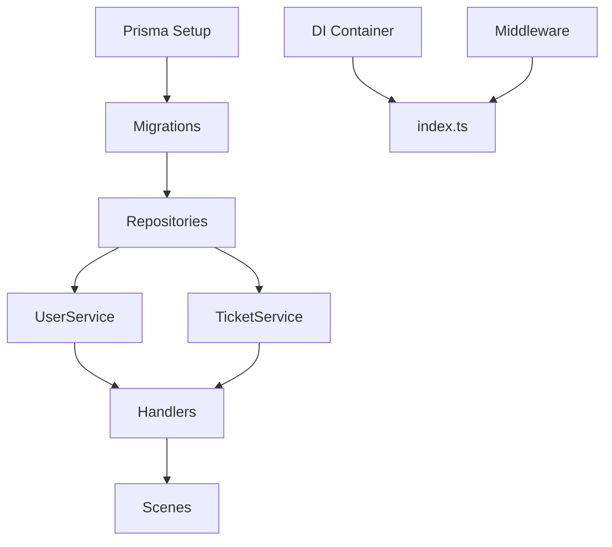

# Roadmap: Telegram Support Bot (DDD Architecture)

## 📊 Общая статистика
- **Всего задач**: 28
- **P0 (критичные)**: 2
- **P1 (высокий приоритет)**: 7
- **P2 (средний приоритет)**: 11
- **P3 (низкий приоритет)**: 8

---

## 🔴 Phase 1: Инфраструктура и База данных (P0)

### ✅ Готовы к работе:

#### 1. Настройка Prisma ORM и PostgreSQL `[bandboats-support-bot-e0r]`
**Приоритет**: P0 | **Тип**: task  
**Описание**: Установить @prisma/client и prisma, создать schema.prisma с моделями User, Ticket, TicketMessage согласно DDD сущностям, настроить подключение к PostgreSQL

#### 2. Создание Prisma миграций `[bandboats-support-bot-74u]`
**Приоритет**: P0 | **Тип**: task  
**Зависит от**: `bandboats-support-bot-e0r`  
**Описание**: Создать и применить первую миграцию Prisma: инициализация схемы БД, создание таблиц users, tickets, ticket_messages с индексами и связями

---

## 🟡 Phase 2: Core Layer (P1)

### 3. Настройка переменных окружения (.env) `[bandboats-support-bot-1oq]`
**Приоритет**: P1 | **Тип**: task  
**Описание**: Создать .env.example с переменными: DATABASE_URL, BOT_TOKEN, NODE_ENV, LOG_LEVEL, PORT и документировать каждую переменную

### 4. Реализация Prisma репозиториев (Infrastructure Layer) `[bandboats-support-bot-sn3]`
**Приоритет**: P1 | **Тип**: task  
**Зависит от**: `bandboats-support-bot-74u`  
**Описание**: Создать PrismaUserRepository, PrismaTicketRepository, PrismaTicketMessageRepository в src/infrastructure/repositories/, реализовать интерфейсы из domain/repositories

### 5. Реализация UserService (Application Layer) `[bandboats-support-bot-1ai]`
**Приоритет**: P1 | **Тип**: task  
**Зависит от**: `bandboats-support-bot-sn3`  
**Описание**: Создать UserService в src/core/service/UserService/ с методами: registerUser, findUserByTelegramId, assignRole, getUsersByRole

### 6. Реализация TicketService (Application Layer) `[bandboats-support-bot-cml]`
**Приоритет**: P1 | **Тип**: task  
**Зависит от**: `bandboats-support-bot-sn3`  
**Описание**: Создать TicketService в src/core/service/TicketService/ с методами: createTicket, assignTicket, addMessage, closeTicket, getTicketsByUser, changeStatus

### 7. Настройка Dependency Injection контейнера `[bandboats-support-bot-dq2]`
**Приоритет**: P1 | **Тип**: task  
**Описание**: Настроить DI контейнер (tsyringe/inversify) для инъекции зависимостей: репозитории, сервисы, Prisma Client

### 8. Создание системы обработки ошибок `[bandboats-support-bot-usj]`
**Приоритет**: P1 | **Тип**: task  
**Описание**: Создать custom exceptions в src/core/exceptions/: DomainException, UserNotFoundException, TicketNotFoundException, UnauthorizedException и error handler для бота

### 9. Создание главной точки входа src/index.ts `[bandboats-support-bot-1ez]`
**Приоритет**: P1 | **Тип**: task  
**Зависит от**: `bandboats-support-bot-dq2`, `bandboats-support-bot-c2c`  
**Описание**: Создать index.ts с инициализацией: загрузка .env, подключение к БД, инициализация DI контейнера, запуск Telegraf бота, graceful shutdown

---

## 🟢 Phase 3: Telegram Bot Interface (P2)

### 10. Создание Telegram Bot middleware `[bandboats-support-bot-c2c]`
**Приоритет**: P2 | **Тип**: task  
**Описание**: Создать middleware в src/interface/telegram/middleware/: auth.middleware.ts (проверка регистрации), role.middleware.ts (проверка прав доступа), error.middleware.ts (обработка ошибок)

### 11. Создание Telegram Bot обработчиков команд `[bandboats-support-bot-ihs]`
**Приоритет**: P2 | **Тип**: task  
**Зависит от**: `bandboats-support-bot-1ai`, `bandboats-support-bot-cml`  
**Описание**: Создать handlers в src/interface/telegram/handlers/: start.handler.ts, help.handler.ts, newticket.handler.ts, mytickets.handler.ts с использованием Telegraf

### 12. Реализация Telegram Bot сцен (Scenes) `[bandboats-support-bot-34u]`
**Приоритет**: P2 | **Тип**: task  
**Зависит от**: `bandboats-support-bot-ihs`  
**Описание**: Создать сцены Telegraf в src/interface/telegram/scenes/: createTicketScene (многошаговое создание тикета), addMessageScene (добавление сообщения в тикет)

### 13. Создание Inline клавиатур и кнопок `[bandboats-support-bot-fi8]`
**Приоритет**: P2 | **Тип**: task  
**Описание**: Создать keyboards в src/interface/telegram/keyboards/: mainKeyboard, ticketActionsKeyboard, adminKeyboard с использованием Telegraf Markup API

### 14. Реализация обработчиков callback queries `[bandboats-support-bot-8ky]`
**Приоритет**: P2 | **Тип**: task  
**Описание**: Создать callback handlers в src/interface/telegram/callbacks/ для обработки нажатий на inline кнопки: assignTicket, closeTicket, viewTicketDetails

### 15. Настройка логирования (Winston/Pino) `[bandboats-support-bot-8dl]`
**Приоритет**: P2 | **Тип**: task  
**Описание**: Установить и настроить систему логирования Winston или Pino в src/infrastructure/logging/ с логами в файл и консоль, разные уровни логирования

### 16. Создание Docker конфигурации `[bandboats-support-bot-bfw]`
**Приоритет**: P2 | **Тип**: task  
**Описание**: Создать Dockerfile для приложения, docker-compose.yml с сервисами: app, postgres, добавить health checks и volume для БД

---

## 🔵 Phase 4: Расширенные функции (P2 Features)

### 17. Добавление функции уведомлений админам `[bandboats-support-bot-xz0]`
**Приоритет**: P2 | **Тип**: feature  
**Описание**: Реализовать NotificationService для отправки уведомлений админам при создании нового тикета, автоматическая рассылка через Telegraf

### 18. Реализация пагинации для списка тикетов `[bandboats-support-bot-tbj]`
**Приоритет**: P2 | **Тип**: feature  
**Описание**: Добавить пагинацию в TicketRepository и TicketService, создать keyboard с кнопками навигации (назад/вперед) для команды /mytickets

### 19. Добавление поддержки вложений (файлы/фото) `[bandboats-support-bot-rwk]`
**Приоритет**: P2 | **Тип**: feature  
**Описание**: Расширить TicketMessage для поддержки file_id, добавить обработку загрузки файлов/фото в сцены, сохранение ссылок на файлы Telegram

### 20. Добавление rate limiting `[bandboats-support-bot-q3l]`
**Приоритет**: P2 | **Тип**: feature  
**Описание**: Реализовать rate limiting middleware для защиты от спама: ограничение на количество сообщений/команд в минуту, использовать bottleneck или custom решение

---

## ⚪ Phase 5: Тестирование и DevOps (P3)

### 21. Создание seed скрипта для тестовых данных `[bandboats-support-bot-9sp]`
**Приоритет**: P3 | **Тип**: task  
**Зависит от**: `bandboats-support-bot-74u`  
**Описание**: Создать prisma/seed.ts для генерации тестовых данных: админ пользователь, несколько клиентов, примеры тикетов с сообщениями

### 22. Написание unit тестов для сервисов `[bandboats-support-bot-8tn]`
**Приоритет**: P3 | **Тип**: task  
**Описание**: Написать unit тесты с Jest для UserService и TicketService, использовать моки репозиториев, тестировать бизнес-логику

### 23. Написание интеграционных тестов для репозиториев `[bandboats-support-bot-8lg]`
**Приоритет**: P3 | **Тип**: task  
**Описание**: Написать интеграционные тесты с Jest для Prisma репозиториев, использовать тестовую БД, тестировать CRUD операции

### 24. Настройка CI/CD pipeline `[bandboats-support-bot-dz1]`
**Приоритет**: P3 | **Тип**: task  
**Описание**: Создать .github/workflows/ci.yml: запуск тестов, линтинг, проверка типов TypeScript, сборка Docker образа при push в main

### 25. Обновление README.md с инструкциями `[bandboats-support-bot-0oy]`
**Приоритет**: P3 | **Тип**: task  
**Описание**: Обновить README.md: описание проекта, установка, настройка, запуск, использование команд бота, архитектура, contributing guidelines

---

## 🎯 Phase 6: Дополнительные фичи (P3 Features)

### 26. Добавление поиска тикетов по фильтрам `[bandboats-support-bot-v6e]`
**Приоритет**: P3 | **Тип**: feature  
**Описание**: Реализовать метод searchTickets в TicketService с фильтрами: по статусу, по автору, по дате создания, команда бота /search для админов

### 27. Реализация статистики для админов `[bandboats-support-bot-1fa]`
**Приоритет**: P3 | **Тип**: feature  
**Описание**: Создать StatsService для получения статистики: количество открытых/закрытых тикетов, среднее время решения, топ активных пользователей, команда /stats

### 28. Создание системы приоритетов тикетов `[bandboats-support-bot-0bz]`
**Приоритет**: P3 | **Тип**: feature  
**Описание**: Добавить enum Priority (LOW, MEDIUM, HIGH, URGENT) в Ticket entity, миграция БД, UI для выбора приоритета, сортировка по приоритету

---

## 🚀 Как начать работу

### Доступные для работы задачи (без блокеров):

1. **[P0]** Настройка Prisma ORM и PostgreSQL `[bandboats-support-bot-e0r]`
2. **[P1]** Настройка Dependency Injection контейнера `[bandboats-support-bot-dq2]`
3. **[P1]** Создание системы обработки ошибок `[bandboats-support-bot-usj]`
4. **[P1]** Настройка переменных окружения (.env) `[bandboats-support-bot-1oq]`
5. **[P2]** Создание Telegram Bot middleware `[bandboats-support-bot-c2c]`
6. **[P2]** Создание Inline клавиатур и кнопок `[bandboats-support-bot-fi8]`
7. **[P2]** Реализация обработчиков callback queries `[bandboats-support-bot-8ky]`
8. **[P2]** Настройка логирования (Winston/Pino) `[bandboats-support-bot-8dl]`
9. **[P2]** Создание Docker конфигурации `[bandboats-support-bot-bfw]`
10. **[P2]** Добавление функции уведомлений админам `[bandboats-support-bot-xz0]`

### Рекомендуемый порядок выполнения:



---

## 📝 Команды Beads

```bash
# Посмотреть все задачи
bd list

# Посмотреть задачи готовые к работе
bd ready

# Посмотреть детали задачи
bd show <issue-id>

# Начать работу над задачей
bd update <issue-id> --status in_progress

# Закрыть задачу
bd close <issue-id>

# Синхронизация с git
bd sync
```

---

**Дата создания roadmap**: 2025-12-31  
**Версия проекта**: 1.0.0-alpha
