# Beads Export

*Generated: Sun, 04 Jan 2026 13:13:15 MSK*

## Summary

| Metric | Count |
|--------|-------|
| **Total** | 33 |
| Open | 20 |
| In Progress | 0 |
| Blocked | 0 |
| Closed | 13 |

## Quick Actions

Ready-to-run commands for bulk operations:

```bash
# Close open items (20 total, showing first 10)
bd close bandboats-support-bot-hub bandboats-support-bot-amh bandboats-support-bot-mzn bandboats-support-bot-q3l bandboats-support-bot-rwk bandboats-support-bot-tbj bandboats-support-bot-xz0 bandboats-support-bot-bfw bandboats-support-bot-8dl bandboats-support-bot-8ky

```

## Table of Contents

- [🟢 bandboats-support-bot-hub Добавление Factory patterns для создания entities](#bandboats-support-bot-hub)
- [🟢 bandboats-support-bot-amh Создание Domain Events](#bandboats-support-bot-amh)
- [🟢 bandboats-support-bot-mzn Создание Value Objects для domain слоя](#bandboats-support-bot-mzn)
- [🟢 bandboats-support-bot-q3l Добавление rate limiting](#bandboats-support-bot-q3l)
- [🟢 bandboats-support-bot-rwk Добавление поддержки вложений (файлы/фото)](#bandboats-support-bot-rwk)
- [🟢 bandboats-support-bot-tbj Реализация пагинации для списка тикетов](#bandboats-support-bot-tbj)
- [🟢 bandboats-support-bot-xz0 Добавление функции уведомлений админам](#bandboats-support-bot-xz0)
- [🟢 bandboats-support-bot-bfw Создание Docker конфигурации](#bandboats-support-bot-bfw)
- [🟢 bandboats-support-bot-8dl Настройка логирования (Winston/Pino)](#bandboats-support-bot-8dl)
- [🟢 bandboats-support-bot-8ky Реализация обработчиков callback queries](#bandboats-support-bot-8ky)
- [🟢 bandboats-support-bot-fi8 Создание Inline клавиатур и кнопок](#bandboats-support-bot-fi8)
- [🟢 bandboats-support-bot-34u Реализация Telegram Bot сцен (Scenes)](#bandboats-support-bot-34u)
- [🟢 bandboats-support-bot-0bz Создание системы приоритетов тикетов](#bandboats-support-bot-0bz)
- [🟢 bandboats-support-bot-1fa Реализация статистики для админов](#bandboats-support-bot-1fa)
- [🟢 bandboats-support-bot-v6e Добавление поиска тикетов по фильтрам](#bandboats-support-bot-v6e)
- [🟢 bandboats-support-bot-dz1 Настройка CI/CD pipeline](#bandboats-support-bot-dz1)
- [🟢 bandboats-support-bot-0oy Обновление README.md с инструкциями](#bandboats-support-bot-0oy)
- [🟢 bandboats-support-bot-8lg Написание интеграционных тестов для репозиториев](#bandboats-support-bot-8lg)
- [🟢 bandboats-support-bot-8tn Написание unit тестов для сервисов](#bandboats-support-bot-8tn)
- [🟢 bandboats-support-bot-9sp Создание seed скрипта для тестовых данных](#bandboats-support-bot-9sp)
- [⚫ bandboats-support-bot-74u Создание Prisma миграций](#bandboats-support-bot-74u)
- [⚫ bandboats-support-bot-e0r Настройка Prisma ORM и PostgreSQL](#bandboats-support-bot-e0r)
- [⚫ bandboats-support-bot-46e Обогащение User entity бизнес-логикой](#bandboats-support-bot-46e)
- [⚫ bandboats-support-bot-jr2 Обогащение Ticket entity бизнес-логикой](#bandboats-support-bot-jr2)
- [⚫ bandboats-support-bot-1oq Настройка переменных окружения (.env)](#bandboats-support-bot-1oq)
- [⚫ bandboats-support-bot-1ez Создание главной точки входа src/index.ts](#bandboats-support-bot-1ez)
- [⚫ bandboats-support-bot-usj Создание системы обработки ошибок](#bandboats-support-bot-usj)
- [⚫ bandboats-support-bot-dq2 Настройка Dependency Injection контейнера](#bandboats-support-bot-dq2)
- [⚫ bandboats-support-bot-cml Реализация TicketService (Application Layer)](#bandboats-support-bot-cml)
- [⚫ bandboats-support-bot-1ai Реализация UserService (Application Layer)](#bandboats-support-bot-1ai)
- [⚫ bandboats-support-bot-sn3 Реализация Prisma репозиториев (Infrastructure Layer)](#bandboats-support-bot-sn3)
- [⚫ bandboats-support-bot-c2c Создание Telegram Bot middleware](#bandboats-support-bot-c2c)
- [⚫ bandboats-support-bot-ihs Создание Telegram Bot обработчиков команд](#bandboats-support-bot-ihs)

---

## Dependency Graph

```mermaid
graph TD
    classDef open fill:#50FA7B,stroke:#333,color:#000
    classDef inprogress fill:#8BE9FD,stroke:#333,color:#000
    classDef blocked fill:#FF5555,stroke:#333,color:#000
    classDef closed fill:#6272A4,stroke:#333,color:#fff

    bandboats-support-bot-0bz["bandboats-support-bot-0bz<br/>Создание системы приоритетов тикетов"]
    class bandboats-support-bot-0bz open
    bandboats-support-bot-0oy["bandboats-support-bot-0oy<br/>Обновление README.md с инструкциями"]
    class bandboats-support-bot-0oy open
    bandboats-support-bot-1ai["bandboats-support-bot-1ai<br/>Реализация UserService (Application L..."]
    class bandboats-support-bot-1ai closed
    bandboats-support-bot-1ez["bandboats-support-bot-1ez<br/>Создание главной точки входа src/inde..."]
    class bandboats-support-bot-1ez closed
    bandboats-support-bot-1fa["bandboats-support-bot-1fa<br/>Реализация статистики для админов"]
    class bandboats-support-bot-1fa open
    bandboats-support-bot-1oq["bandboats-support-bot-1oq<br/>Настройка переменных окружения (.env)"]
    class bandboats-support-bot-1oq closed
    bandboats-support-bot-34u["bandboats-support-bot-34u<br/>Реализация Telegram Bot сцен (Scenes)"]
    class bandboats-support-bot-34u open
    bandboats-support-bot-46e["bandboats-support-bot-46e<br/>Обогащение User entity бизнес-логикой"]
    class bandboats-support-bot-46e closed
    bandboats-support-bot-74u["bandboats-support-bot-74u<br/>Создание Prisma миграций"]
    class bandboats-support-bot-74u closed
    bandboats-support-bot-8dl["bandboats-support-bot-8dl<br/>Настройка логирования (Winston/Pino)"]
    class bandboats-support-bot-8dl open
    bandboats-support-bot-8ky["bandboats-support-bot-8ky<br/>Реализация обработчиков callback queries"]
    class bandboats-support-bot-8ky open
    bandboats-support-bot-8lg["bandboats-support-bot-8lg<br/>Написание интеграционных тестов для р..."]
    class bandboats-support-bot-8lg open
    bandboats-support-bot-8tn["bandboats-support-bot-8tn<br/>Написание unit тестов для сервисов"]
    class bandboats-support-bot-8tn open
    bandboats-support-bot-9sp["bandboats-support-bot-9sp<br/>Создание seed скрипта для тестовых да..."]
    class bandboats-support-bot-9sp open
    bandboats-support-bot-amh["bandboats-support-bot-amh<br/>Создание Domain Events"]
    class bandboats-support-bot-amh open
    bandboats-support-bot-bfw["bandboats-support-bot-bfw<br/>Создание Docker конфигурации"]
    class bandboats-support-bot-bfw open
    bandboats-support-bot-c2c["bandboats-support-bot-c2c<br/>Создание Telegram Bot middleware"]
    class bandboats-support-bot-c2c closed
    bandboats-support-bot-cml["bandboats-support-bot-cml<br/>Реализация TicketService (Application..."]
    class bandboats-support-bot-cml closed
    bandboats-support-bot-dq2["bandboats-support-bot-dq2<br/>Настройка Dependency Injection контей..."]
    class bandboats-support-bot-dq2 closed
    bandboats-support-bot-dz1["bandboats-support-bot-dz1<br/>Настройка CI/CD pipeline"]
    class bandboats-support-bot-dz1 open
    bandboats-support-bot-e0r["bandboats-support-bot-e0r<br/>Настройка Prisma ORM и PostgreSQL"]
    class bandboats-support-bot-e0r closed
    bandboats-support-bot-fi8["bandboats-support-bot-fi8<br/>Создание Inline клавиатур и кнопок"]
    class bandboats-support-bot-fi8 open
    bandboats-support-bot-hub["bandboats-support-bot-hub<br/>Добавление Factory patterns для созда..."]
    class bandboats-support-bot-hub open
    bandboats-support-bot-ihs["bandboats-support-bot-ihs<br/>Создание Telegram Bot обработчиков ко..."]
    class bandboats-support-bot-ihs closed
    bandboats-support-bot-jr2["bandboats-support-bot-jr2<br/>Обогащение Ticket entity бизнес-логикой"]
    class bandboats-support-bot-jr2 closed
    bandboats-support-bot-mzn["bandboats-support-bot-mzn<br/>Создание Value Objects для domain слоя"]
    class bandboats-support-bot-mzn open
    bandboats-support-bot-q3l["bandboats-support-bot-q3l<br/>Добавление rate limiting"]
    class bandboats-support-bot-q3l open
    bandboats-support-bot-rwk["bandboats-support-bot-rwk<br/>Добавление поддержки вложений (файлы/..."]
    class bandboats-support-bot-rwk open
    bandboats-support-bot-sn3["bandboats-support-bot-sn3<br/>Реализация Prisma репозиториев (Infra..."]
    class bandboats-support-bot-sn3 closed
    bandboats-support-bot-tbj["bandboats-support-bot-tbj<br/>Реализация пагинации для списка тикетов"]
    class bandboats-support-bot-tbj open
    bandboats-support-bot-usj["bandboats-support-bot-usj<br/>Создание системы обработки ошибок"]
    class bandboats-support-bot-usj closed
    bandboats-support-bot-v6e["bandboats-support-bot-v6e<br/>Добавление поиска тикетов по фильтрам"]
    class bandboats-support-bot-v6e open
    bandboats-support-bot-xz0["bandboats-support-bot-xz0<br/>Добавление функции уведомлений админам"]
    class bandboats-support-bot-xz0 open

    bandboats-support-bot-1ai ==> bandboats-support-bot-46e
    bandboats-support-bot-1ai ==> bandboats-support-bot-jr2
    bandboats-support-bot-1ai ==> bandboats-support-bot-sn3
    bandboats-support-bot-1ez ==> bandboats-support-bot-c2c
    bandboats-support-bot-1ez ==> bandboats-support-bot-dq2
    bandboats-support-bot-34u ==> bandboats-support-bot-ihs
    bandboats-support-bot-74u ==> bandboats-support-bot-e0r
    bandboats-support-bot-9sp ==> bandboats-support-bot-74u
    bandboats-support-bot-cml ==> bandboats-support-bot-46e
    bandboats-support-bot-cml ==> bandboats-support-bot-jr2
    bandboats-support-bot-cml ==> bandboats-support-bot-sn3
    bandboats-support-bot-ihs ==> bandboats-support-bot-1ai
    bandboats-support-bot-ihs ==> bandboats-support-bot-cml
    bandboats-support-bot-sn3 ==> bandboats-support-bot-74u
```



---

## 📋 bandboats-support-bot-hub Добавление Factory patterns для создания entities

| Property | Value |
|----------|-------|
| **Type** | 📋 task |
| **Priority** | 🔹 Medium (P2) |
| **Status** | 🟢 open |
| **Created** | 2025-12-31 22:05 |
| **Updated** | 2025-12-31 22:05 |

### Description

Создать UserFactory и TicketFactory для инкапсуляции логики создания сущностей с валидацией начального состояния и генерацией ID

<details>
<summary>📋 Commands</summary>

```bash
# Start working on this issue
bd update bandboats-support-bot-hub -s in_progress

# Add a comment
bd comment bandboats-support-bot-hub 'Your comment here'

# Change priority (0=Critical, 1=High, 2=Medium, 3=Low)
bd update bandboats-support-bot-hub -p 1

# View full details
bd show bandboats-support-bot-hub
```

</details>

---

## 📋 bandboats-support-bot-amh Создание Domain Events

| Property | Value |
|----------|-------|
| **Type** | 📋 task |
| **Priority** | 🔹 Medium (P2) |
| **Status** | 🟢 open |
| **Created** | 2025-12-31 22:05 |
| **Updated** | 2025-12-31 22:05 |

### Description

Создать domain events: TicketCreated, TicketAssigned, TicketClosed, MessageAdded, UserRegistered. Добавить механизм публикации событий в entities

<details>
<summary>📋 Commands</summary>

```bash
# Start working on this issue
bd update bandboats-support-bot-amh -s in_progress

# Add a comment
bd comment bandboats-support-bot-amh 'Your comment here'

# Change priority (0=Critical, 1=High, 2=Medium, 3=Low)
bd update bandboats-support-bot-amh -p 1

# View full details
bd show bandboats-support-bot-amh
```

</details>

---

## 📋 bandboats-support-bot-mzn Создание Value Objects для domain слоя

| Property | Value |
|----------|-------|
| **Type** | 📋 task |
| **Priority** | 🔹 Medium (P2) |
| **Status** | 🟢 open |
| **Created** | 2025-12-31 22:05 |
| **Updated** | 2025-12-31 22:05 |

### Description

Создать Value Objects: TelegramId, TicketTitle, MessageContent с валидацией. Заменить примитивные типы в entities на Value Objects для type safety

<details>
<summary>📋 Commands</summary>

```bash
# Start working on this issue
bd update bandboats-support-bot-mzn -s in_progress

# Add a comment
bd comment bandboats-support-bot-mzn 'Your comment here'

# Change priority (0=Critical, 1=High, 2=Medium, 3=Low)
bd update bandboats-support-bot-mzn -p 1

# View full details
bd show bandboats-support-bot-mzn
```

</details>

---

## ✨ bandboats-support-bot-q3l Добавление rate limiting

| Property | Value |
|----------|-------|
| **Type** | ✨ feature |
| **Priority** | 🔹 Medium (P2) |
| **Status** | 🟢 open |
| **Created** | 2025-12-31 21:51 |
| **Updated** | 2025-12-31 21:51 |

### Description

Реализовать rate limiting middleware для защиты от спама: ограничение на количество сообщений/команд в минуту, использовать bottleneck или custom решение

<details>
<summary>📋 Commands</summary>

```bash
# Start working on this issue
bd update bandboats-support-bot-q3l -s in_progress

# Add a comment
bd comment bandboats-support-bot-q3l 'Your comment here'

# Change priority (0=Critical, 1=High, 2=Medium, 3=Low)
bd update bandboats-support-bot-q3l -p 1

# View full details
bd show bandboats-support-bot-q3l
```

</details>

---

## ✨ bandboats-support-bot-rwk Добавление поддержки вложений (файлы/фото)

| Property | Value |
|----------|-------|
| **Type** | ✨ feature |
| **Priority** | 🔹 Medium (P2) |
| **Status** | 🟢 open |
| **Created** | 2025-12-31 21:51 |
| **Updated** | 2025-12-31 21:51 |

### Description

Расширить TicketMessage для поддержки file_id, добавить обработку загрузки файлов/фото в сцены, сохранение ссылок на файлы Telegram

<details>
<summary>📋 Commands</summary>

```bash
# Start working on this issue
bd update bandboats-support-bot-rwk -s in_progress

# Add a comment
bd comment bandboats-support-bot-rwk 'Your comment here'

# Change priority (0=Critical, 1=High, 2=Medium, 3=Low)
bd update bandboats-support-bot-rwk -p 1

# View full details
bd show bandboats-support-bot-rwk
```

</details>

---

## ✨ bandboats-support-bot-tbj Реализация пагинации для списка тикетов

| Property | Value |
|----------|-------|
| **Type** | ✨ feature |
| **Priority** | 🔹 Medium (P2) |
| **Status** | 🟢 open |
| **Created** | 2025-12-31 21:51 |
| **Updated** | 2025-12-31 21:51 |

### Description

Добавить пагинацию в TicketRepository и TicketService, создать keyboard с кнопками навигации (назад/вперед) для команды /mytickets

<details>
<summary>📋 Commands</summary>

```bash
# Start working on this issue
bd update bandboats-support-bot-tbj -s in_progress

# Add a comment
bd comment bandboats-support-bot-tbj 'Your comment here'

# Change priority (0=Critical, 1=High, 2=Medium, 3=Low)
bd update bandboats-support-bot-tbj -p 1

# View full details
bd show bandboats-support-bot-tbj
```

</details>

---

## ✨ bandboats-support-bot-xz0 Добавление функции уведомлений админам

| Property | Value |
|----------|-------|
| **Type** | ✨ feature |
| **Priority** | 🔹 Medium (P2) |
| **Status** | 🟢 open |
| **Created** | 2025-12-31 21:51 |
| **Updated** | 2025-12-31 21:51 |

### Description

Реализовать NotificationService для отправки уведомлений админам при создании нового тикета, автоматическая рассылка через Telegraf

<details>
<summary>📋 Commands</summary>

```bash
# Start working on this issue
bd update bandboats-support-bot-xz0 -s in_progress

# Add a comment
bd comment bandboats-support-bot-xz0 'Your comment here'

# Change priority (0=Critical, 1=High, 2=Medium, 3=Low)
bd update bandboats-support-bot-xz0 -p 1

# View full details
bd show bandboats-support-bot-xz0
```

</details>

---

## 📋 bandboats-support-bot-bfw Создание Docker конфигурации

| Property | Value |
|----------|-------|
| **Type** | 📋 task |
| **Priority** | 🔹 Medium (P2) |
| **Status** | 🟢 open |
| **Created** | 2025-12-31 21:50 |
| **Updated** | 2025-12-31 21:50 |

### Description

Создать Dockerfile для приложения, docker-compose.yml с сервисами: app, postgres, добавить health checks и volume для БД

<details>
<summary>📋 Commands</summary>

```bash
# Start working on this issue
bd update bandboats-support-bot-bfw -s in_progress

# Add a comment
bd comment bandboats-support-bot-bfw 'Your comment here'

# Change priority (0=Critical, 1=High, 2=Medium, 3=Low)
bd update bandboats-support-bot-bfw -p 1

# View full details
bd show bandboats-support-bot-bfw
```

</details>

---

## 📋 bandboats-support-bot-8dl Настройка логирования (Winston/Pino)

| Property | Value |
|----------|-------|
| **Type** | 📋 task |
| **Priority** | 🔹 Medium (P2) |
| **Status** | 🟢 open |
| **Created** | 2025-12-31 21:50 |
| **Updated** | 2025-12-31 21:50 |

### Description

Установить и настроить систему логирования Winston или Pino в src/infrastructure/logging/ с логами в файл и консоль, разные уровни логирования

<details>
<summary>📋 Commands</summary>

```bash
# Start working on this issue
bd update bandboats-support-bot-8dl -s in_progress

# Add a comment
bd comment bandboats-support-bot-8dl 'Your comment here'

# Change priority (0=Critical, 1=High, 2=Medium, 3=Low)
bd update bandboats-support-bot-8dl -p 1

# View full details
bd show bandboats-support-bot-8dl
```

</details>

---

## 📋 bandboats-support-bot-8ky Реализация обработчиков callback queries

| Property | Value |
|----------|-------|
| **Type** | 📋 task |
| **Priority** | 🔹 Medium (P2) |
| **Status** | 🟢 open |
| **Created** | 2025-12-31 21:50 |
| **Updated** | 2025-12-31 21:50 |

### Description

Создать callback handlers в src/interface/telegram/callbacks/ для обработки нажатий на inline кнопки: assignTicket, closeTicket, viewTicketDetails

<details>
<summary>📋 Commands</summary>

```bash
# Start working on this issue
bd update bandboats-support-bot-8ky -s in_progress

# Add a comment
bd comment bandboats-support-bot-8ky 'Your comment here'

# Change priority (0=Critical, 1=High, 2=Medium, 3=Low)
bd update bandboats-support-bot-8ky -p 1

# View full details
bd show bandboats-support-bot-8ky
```

</details>

---

## 📋 bandboats-support-bot-fi8 Создание Inline клавиатур и кнопок

| Property | Value |
|----------|-------|
| **Type** | 📋 task |
| **Priority** | 🔹 Medium (P2) |
| **Status** | 🟢 open |
| **Created** | 2025-12-31 21:50 |
| **Updated** | 2025-12-31 21:50 |

### Description

Создать keyboards в src/interface/telegram/keyboards/: mainKeyboard, ticketActionsKeyboard, adminKeyboard с использованием Telegraf Markup API

<details>
<summary>📋 Commands</summary>

```bash
# Start working on this issue
bd update bandboats-support-bot-fi8 -s in_progress

# Add a comment
bd comment bandboats-support-bot-fi8 'Your comment here'

# Change priority (0=Critical, 1=High, 2=Medium, 3=Low)
bd update bandboats-support-bot-fi8 -p 1

# View full details
bd show bandboats-support-bot-fi8
```

</details>

---

## 📋 bandboats-support-bot-34u Реализация Telegram Bot сцен (Scenes)

| Property | Value |
|----------|-------|
| **Type** | 📋 task |
| **Priority** | 🔹 Medium (P2) |
| **Status** | 🟢 open |
| **Created** | 2025-12-31 21:50 |
| **Updated** | 2025-12-31 21:50 |

### Description

Создать сцены Telegraf в src/interface/telegram/scenes/: createTicketScene (многошаговое создание тикета), addMessageScene (добавление сообщения в тикет)

### Dependencies

- ⛔ **blocks**: `bandboats-support-bot-ihs`

<details>
<summary>📋 Commands</summary>

```bash
# Start working on this issue
bd update bandboats-support-bot-34u -s in_progress

# Add a comment
bd comment bandboats-support-bot-34u 'Your comment here'

# Change priority (0=Critical, 1=High, 2=Medium, 3=Low)
bd update bandboats-support-bot-34u -p 1

# View full details
bd show bandboats-support-bot-34u
```

</details>

---

## ✨ bandboats-support-bot-0bz Создание системы приоритетов тикетов

| Property | Value |
|----------|-------|
| **Type** | ✨ feature |
| **Priority** | ☕ Low (P3) |
| **Status** | 🟢 open |
| **Created** | 2025-12-31 21:51 |
| **Updated** | 2025-12-31 21:51 |

### Description

Добавить enum Priority (LOW, MEDIUM, HIGH, URGENT) в Ticket entity, миграция БД, UI для выбора приоритета, сортировка по приоритету

<details>
<summary>📋 Commands</summary>

```bash
# Start working on this issue
bd update bandboats-support-bot-0bz -s in_progress

# Add a comment
bd comment bandboats-support-bot-0bz 'Your comment here'

# Change priority (0=Critical, 1=High, 2=Medium, 3=Low)
bd update bandboats-support-bot-0bz -p 1

# View full details
bd show bandboats-support-bot-0bz
```

</details>

---

## ✨ bandboats-support-bot-1fa Реализация статистики для админов

| Property | Value |
|----------|-------|
| **Type** | ✨ feature |
| **Priority** | ☕ Low (P3) |
| **Status** | 🟢 open |
| **Created** | 2025-12-31 21:51 |
| **Updated** | 2025-12-31 21:51 |

### Description

Создать StatsService для получения статистики: количество открытых/закрытых тикетов, среднее время решения, топ активных пользователей, команда /stats

<details>
<summary>📋 Commands</summary>

```bash
# Start working on this issue
bd update bandboats-support-bot-1fa -s in_progress

# Add a comment
bd comment bandboats-support-bot-1fa 'Your comment here'

# Change priority (0=Critical, 1=High, 2=Medium, 3=Low)
bd update bandboats-support-bot-1fa -p 1

# View full details
bd show bandboats-support-bot-1fa
```

</details>

---

## ✨ bandboats-support-bot-v6e Добавление поиска тикетов по фильтрам

| Property | Value |
|----------|-------|
| **Type** | ✨ feature |
| **Priority** | ☕ Low (P3) |
| **Status** | 🟢 open |
| **Created** | 2025-12-31 21:51 |
| **Updated** | 2025-12-31 21:51 |

### Description

Реализовать метод searchTickets в TicketService с фильтрами: по статусу, по автору, по дате создания, команда бота /search для админов

<details>
<summary>📋 Commands</summary>

```bash
# Start working on this issue
bd update bandboats-support-bot-v6e -s in_progress

# Add a comment
bd comment bandboats-support-bot-v6e 'Your comment here'

# Change priority (0=Critical, 1=High, 2=Medium, 3=Low)
bd update bandboats-support-bot-v6e -p 1

# View full details
bd show bandboats-support-bot-v6e
```

</details>

---

## 📋 bandboats-support-bot-dz1 Настройка CI/CD pipeline

| Property | Value |
|----------|-------|
| **Type** | 📋 task |
| **Priority** | ☕ Low (P3) |
| **Status** | 🟢 open |
| **Created** | 2025-12-31 21:51 |
| **Updated** | 2025-12-31 21:51 |

### Description

Создать .github/workflows/ci.yml: запуск тестов, линтинг, проверка типов TypeScript, сборка Docker образа при push в main

<details>
<summary>📋 Commands</summary>

```bash
# Start working on this issue
bd update bandboats-support-bot-dz1 -s in_progress

# Add a comment
bd comment bandboats-support-bot-dz1 'Your comment here'

# Change priority (0=Critical, 1=High, 2=Medium, 3=Low)
bd update bandboats-support-bot-dz1 -p 1

# View full details
bd show bandboats-support-bot-dz1
```

</details>

---

## 📋 bandboats-support-bot-0oy Обновление README.md с инструкциями

| Property | Value |
|----------|-------|
| **Type** | 📋 task |
| **Priority** | ☕ Low (P3) |
| **Status** | 🟢 open |
| **Created** | 2025-12-31 21:50 |
| **Updated** | 2025-12-31 21:50 |

### Description

Обновить README.md: описание проекта, установка, настройка, запуск, использование команд бота, архитектура, contributing guidelines

<details>
<summary>📋 Commands</summary>

```bash
# Start working on this issue
bd update bandboats-support-bot-0oy -s in_progress

# Add a comment
bd comment bandboats-support-bot-0oy 'Your comment here'

# Change priority (0=Critical, 1=High, 2=Medium, 3=Low)
bd update bandboats-support-bot-0oy -p 1

# View full details
bd show bandboats-support-bot-0oy
```

</details>

---

## 📋 bandboats-support-bot-8lg Написание интеграционных тестов для репозиториев

| Property | Value |
|----------|-------|
| **Type** | 📋 task |
| **Priority** | ☕ Low (P3) |
| **Status** | 🟢 open |
| **Created** | 2025-12-31 21:50 |
| **Updated** | 2025-12-31 21:50 |

### Description

Написать интеграционные тесты с Jest для Prisma репозиториев, использовать тестовую БД, тестировать CRUD операции

<details>
<summary>📋 Commands</summary>

```bash
# Start working on this issue
bd update bandboats-support-bot-8lg -s in_progress

# Add a comment
bd comment bandboats-support-bot-8lg 'Your comment here'

# Change priority (0=Critical, 1=High, 2=Medium, 3=Low)
bd update bandboats-support-bot-8lg -p 1

# View full details
bd show bandboats-support-bot-8lg
```

</details>

---

## 📋 bandboats-support-bot-8tn Написание unit тестов для сервисов

| Property | Value |
|----------|-------|
| **Type** | 📋 task |
| **Priority** | ☕ Low (P3) |
| **Status** | 🟢 open |
| **Created** | 2025-12-31 21:50 |
| **Updated** | 2025-12-31 21:50 |

### Description

Написать unit тесты с Jest для UserService и TicketService, использовать моки репозиториев, тестировать бизнес-логику

<details>
<summary>📋 Commands</summary>

```bash
# Start working on this issue
bd update bandboats-support-bot-8tn -s in_progress

# Add a comment
bd comment bandboats-support-bot-8tn 'Your comment here'

# Change priority (0=Critical, 1=High, 2=Medium, 3=Low)
bd update bandboats-support-bot-8tn -p 1

# View full details
bd show bandboats-support-bot-8tn
```

</details>

---

## 📋 bandboats-support-bot-9sp Создание seed скрипта для тестовых данных

| Property | Value |
|----------|-------|
| **Type** | 📋 task |
| **Priority** | ☕ Low (P3) |
| **Status** | 🟢 open |
| **Created** | 2025-12-31 21:50 |
| **Updated** | 2025-12-31 21:50 |

### Description

Создать prisma/seed.ts для генерации тестовых данных: админ пользователь, несколько клиентов, примеры тикетов с сообщениями

### Dependencies

- ⛔ **blocks**: `bandboats-support-bot-74u`

<details>
<summary>📋 Commands</summary>

```bash
# Start working on this issue
bd update bandboats-support-bot-9sp -s in_progress

# Add a comment
bd comment bandboats-support-bot-9sp 'Your comment here'

# Change priority (0=Critical, 1=High, 2=Medium, 3=Low)
bd update bandboats-support-bot-9sp -p 1

# View full details
bd show bandboats-support-bot-9sp
```

</details>

---

## 📋 bandboats-support-bot-74u Создание Prisma миграций

| Property | Value |
|----------|-------|
| **Type** | 📋 task |
| **Priority** | 🔥 Critical (P0) |
| **Status** | ⚫ closed |
| **Created** | 2025-12-31 21:50 |
| **Updated** | 2025-12-31 22:00 |
| **Closed** | 2025-12-31 22:00 |

### Description

Создать и применить первую миграцию Prisma: инициализация схемы БД, создание таблиц users, tickets, ticket_messages с индексами и связями

### Dependencies

- ⛔ **blocks**: `bandboats-support-bot-e0r`

---

## 📋 bandboats-support-bot-e0r Настройка Prisma ORM и PostgreSQL

| Property | Value |
|----------|-------|
| **Type** | 📋 task |
| **Priority** | 🔥 Critical (P0) |
| **Status** | ⚫ closed |
| **Created** | 2025-12-31 21:50 |
| **Updated** | 2025-12-31 21:58 |
| **Closed** | 2025-12-31 21:58 |

### Description

Установить @prisma/client и prisma, создать schema.prisma с моделями User, Ticket, TicketMessage согласно DDD сущностям, настроить подключение к PostgreSQL

---

## 📋 bandboats-support-bot-46e Обогащение User entity бизнес-логикой

| Property | Value |
|----------|-------|
| **Type** | 📋 task |
| **Priority** | ⚡ High (P1) |
| **Status** | ⚫ closed |
| **Created** | 2025-12-31 22:05 |
| **Updated** | 2025-12-31 22:16 |
| **Closed** | 2025-12-31 22:16 |

### Description

Добавить методы в User entity: isAdmin(), isClient(), canManageTicket(ticket), hasRole(role). Добавить валидацию и инварианты пользователя

---

## 📋 bandboats-support-bot-jr2 Обогащение Ticket entity бизнес-логикой

| Property | Value |
|----------|-------|
| **Type** | 📋 task |
| **Priority** | ⚡ High (P1) |
| **Status** | ⚫ closed |
| **Created** | 2025-12-31 22:05 |
| **Updated** | 2025-12-31 22:11 |
| **Closed** | 2025-12-31 22:11 |

### Description

Добавить методы в Ticket entity: assign(assigneeId), changeStatus(status), addMessage(message), canBeClosedBy(userId), isAssignedTo(userId). Добавить валидацию состояний и бизнес-правила согласно DDD

---

## 📋 bandboats-support-bot-1oq Настройка переменных окружения (.env)

| Property | Value |
|----------|-------|
| **Type** | 📋 task |
| **Priority** | ⚡ High (P1) |
| **Status** | ⚫ closed |
| **Created** | 2025-12-31 21:50 |
| **Updated** | 2025-12-31 22:40 |
| **Closed** | 2025-12-31 22:40 |

### Description

Создать .env.example с переменными: DATABASE_URL, BOT_TOKEN, NODE_ENV, LOG_LEVEL, PORT и документировать каждую переменную

---

## 📋 bandboats-support-bot-1ez Создание главной точки входа src/index.ts

| Property | Value |
|----------|-------|
| **Type** | 📋 task |
| **Priority** | ⚡ High (P1) |
| **Status** | ⚫ closed |
| **Created** | 2025-12-31 21:50 |
| **Updated** | 2025-12-31 23:26 |
| **Closed** | 2025-12-31 23:26 |

### Description

Создать index.ts с инициализацией: загрузка .env, подключение к БД, инициализация DI контейнера, запуск Telegraf бота, graceful shutdown

### Dependencies

- ⛔ **blocks**: `bandboats-support-bot-dq2`
- ⛔ **blocks**: `bandboats-support-bot-c2c`

---

## 📋 bandboats-support-bot-usj Создание системы обработки ошибок

| Property | Value |
|----------|-------|
| **Type** | 📋 task |
| **Priority** | ⚡ High (P1) |
| **Status** | ⚫ closed |
| **Created** | 2025-12-31 21:50 |
| **Updated** | 2025-12-31 22:35 |
| **Closed** | 2025-12-31 22:35 |

### Description

Создать custom exceptions в src/core/exceptions/: DomainException, UserNotFoundException, TicketNotFoundException, UnauthorizedException и error handler для бота

---

## 📋 bandboats-support-bot-dq2 Настройка Dependency Injection контейнера

| Property | Value |
|----------|-------|
| **Type** | 📋 task |
| **Priority** | ⚡ High (P1) |
| **Status** | ⚫ closed |
| **Created** | 2025-12-31 21:50 |
| **Updated** | 2025-12-31 22:29 |
| **Closed** | 2025-12-31 22:29 |

### Description

Настроить DI контейнер (tsyringe/inversify) для инъекции зависимостей: репозитории, сервисы, Prisma Client

---

## 📋 bandboats-support-bot-cml Реализация TicketService (Application Layer)

| Property | Value |
|----------|-------|
| **Type** | 📋 task |
| **Priority** | ⚡ High (P1) |
| **Status** | ⚫ closed |
| **Created** | 2025-12-31 21:50 |
| **Updated** | 2025-12-31 22:29 |
| **Closed** | 2025-12-31 22:29 |

### Description

Создать TicketService в src/core/service/TicketService/ с методами: createTicket, assignTicket, addMessage, closeTicket, getTicketsByUser, changeStatus

### Dependencies

- ⛔ **blocks**: `bandboats-support-bot-sn3`
- ⛔ **blocks**: `bandboats-support-bot-jr2`
- ⛔ **blocks**: `bandboats-support-bot-46e`

---

## 📋 bandboats-support-bot-1ai Реализация UserService (Application Layer)

| Property | Value |
|----------|-------|
| **Type** | 📋 task |
| **Priority** | ⚡ High (P1) |
| **Status** | ⚫ closed |
| **Created** | 2025-12-31 21:50 |
| **Updated** | 2025-12-31 22:29 |
| **Closed** | 2025-12-31 22:29 |

### Description

Создать UserService в src/core/service/UserService/ с методами: registerUser, findUserByTelegramId, assignRole, getUsersByRole

### Dependencies

- ⛔ **blocks**: `bandboats-support-bot-sn3`
- ⛔ **blocks**: `bandboats-support-bot-jr2`
- ⛔ **blocks**: `bandboats-support-bot-46e`

---

## 📋 bandboats-support-bot-sn3 Реализация Prisma репозиториев (Infrastructure Layer)

| Property | Value |
|----------|-------|
| **Type** | 📋 task |
| **Priority** | ⚡ High (P1) |
| **Status** | ⚫ closed |
| **Created** | 2025-12-31 21:50 |
| **Updated** | 2025-12-31 22:03 |
| **Closed** | 2025-12-31 22:03 |

### Description

Создать PrismaUserRepository, PrismaTicketRepository, PrismaTicketMessageRepository в src/infrastructure/repositories/, реализовать интерфейсы из domain/repositories

### Dependencies

- ⛔ **blocks**: `bandboats-support-bot-74u`

---

## 📋 bandboats-support-bot-c2c Создание Telegram Bot middleware

| Property | Value |
|----------|-------|
| **Type** | 📋 task |
| **Priority** | 🔹 Medium (P2) |
| **Status** | ⚫ closed |
| **Created** | 2025-12-31 21:50 |
| **Updated** | 2025-12-31 23:21 |
| **Closed** | 2025-12-31 23:21 |

### Description

Создать middleware в src/interface/telegram/middleware/: auth.middleware.ts (проверка регистрации), role.middleware.ts (проверка прав доступа), error.middleware.ts (обработка ошибок)

---

## 📋 bandboats-support-bot-ihs Создание Telegram Bot обработчиков команд

| Property | Value |
|----------|-------|
| **Type** | 📋 task |
| **Priority** | 🔹 Medium (P2) |
| **Status** | ⚫ closed |
| **Created** | 2025-12-31 21:50 |
| **Updated** | 2025-12-31 23:17 |
| **Closed** | 2025-12-31 23:17 |

### Description

Создать handlers в src/interface/telegram/handlers/: start.handler.ts, help.handler.ts, newticket.handler.ts, mytickets.handler.ts с использованием Telegraf

### Dependencies

- ⛔ **blocks**: `bandboats-support-bot-1ai`
- ⛔ **blocks**: `bandboats-support-bot-cml`

---

